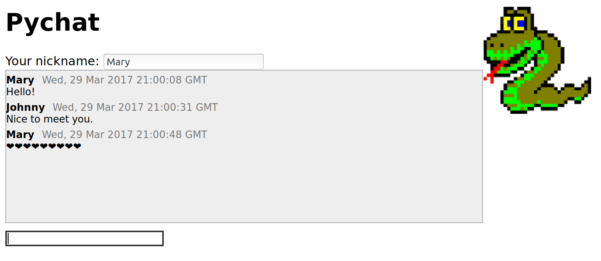

# pychat

Very simple chat server based on Flask.




## Instructions

Create a Python 3 virtualenv. On Unix/Linux/MacOS:

```
virtualenv -p python3 venv
. venv/bin/activate
```

On Windows:

```
python.exe -m venv venv
venv\Scripts\activate
```

Then install requirements (flask):

```
pip install -r requirements.txt
```

Start the chat server:

```
python pychat/server.py 
 * Running on http://0.0.0.0:8080/ (Press CTRL+C to quit)
 * Restarting with stat
 * Debugger is active!
 * Debugger PIN: 673-164-341
```

Point your browser to [http://0.0.0.0:8080](http://0.0.0.0:8080) and start
chatting!

Hint: You can find out your IP address with `ifconfig` and let others use your
chat server.
